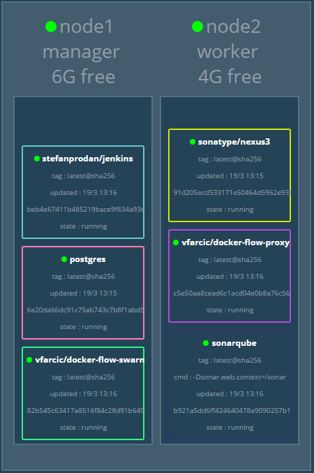

## Tasks:

- Deploy DevOps tools in swarm mode via a compose v3
- Demonstrate Jenkins Blue Ocean pipelines (auto-creating jobs via Jenkinsfile in github that checks code quality (SonarQube) and runs docker image security scanning (Anchore) 

## Prerequisits:

-	Setup docker swarm based infrastructure. Unless you already have infrastructure setup, you may look at my <a href="https://github.com/shazChaudhry/InfraAsCode">InfraAsCode</a> repo
-	Fork this repository
-	Github Personal access token

## Instructions:
- Assuming you have used my <a href="https://github.com/shazChaudhry/InfraAsCode">InfraAsCode</a> repo as mentioned above, you can log into the swarm master node by executing "vagrant ssh node1". Please ensure you execute this command from the same location where Vagrantfile is
- Once inside node1, clone the forked repo and change directory
- Run "docker stack deploy -c docker-compose-stack.yml dev". This will take a couple of minutes to launch stack. 
- In your favorite web browser navigate to <a href="http://node1:9080/">Visualizer</a>. This Visualizer will show all services running in the swarm mode.

The visualizer screen should look simialar to this:

## Test Infrastructure:

- Take a short break and wait until all services are started
- <a href="http://node1:5601">Kibana</a> 
- Grafana yet to come
- <a href="http://node1/jenkins"/>Jenkins</a>. You will need to create admin password
- <a href="http://node1/sonar"/>SonarQube</a>. Username: admin; Password: admin
- <a href="http://node1/nexus"/>Nexus</a>. Username: admin; Password: admin123

## Configure Jenkins and SonarQube

## Configure Nexus
## Test pipeline

## Clean-up:
- ssh to node4 (vagrant ssh node4)
-	To remove services, execute "docker stack rm dev"
-	To tear down the infrastructure, run "vagrant destroy"
