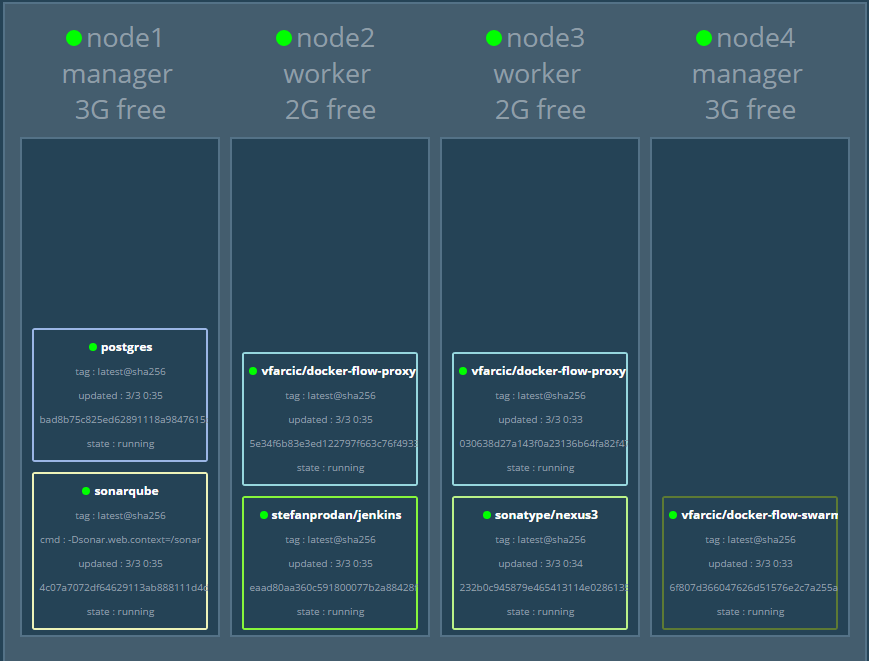
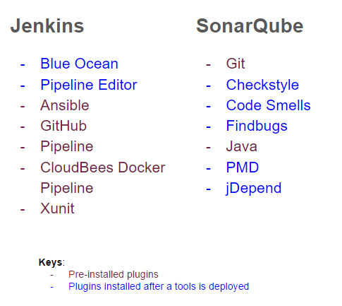

## Demo tasks:

-	Setting up a docker swarm cluster of 4 nodes with vagrant
-	Deploy DevOps tools in swarm mode via a compose v3
- 	Demonstrate Jenkins Blue Ocean pipelines (auto-creating jobs via Jenkinsfile in github that checks code quality (SonarQube) and runs docker image security scanning (Anchore) 

## Prerequisists:

-	Install Docker Toolbox (Includes Git Bash, Virtual Box)
-	Install latest version of Vagrant 
-	Install hostmanager plugin by running "vagrant plugin install vagrant-hostmanager". This will update host files
-	Fork this repository
-	Github Personal access token

## Instructions:

- 	Clone the forked repo
-	Change to the cloned directory and run " vagrant box update" and "vagrant up" commands. This will setup a swarm cluster; 2xworkers and 2xmanagers. Furthermore this will deploy required dev tools as docker services.

The visualizer screen should look simialar to this:

## Test Infrastructure:

- Take a short break and wait until all services are started
-	<a href="http://node1:9080"/>Visualizer</a>
- 	<a href="http://node1/jenkins"/>Jenkins</a>. You will need to create admin password
-	<a href="http://node1/sonar"/>SonarQube</a>. Username: admin; Password: admin
-	<a href="http://node1/nexus"/>Nexus</a>. Username: admin; Password: admin123

## Configure Jenkins and SonarQube

## Configure Nexus
## Test pipeline

## Clean-up:
- ssh to node4 (vagrant ssh node4)
-	To remove services, execute "docker stack rm dev"
-	To tear down the infrastructure, run "vagrant destroy"
